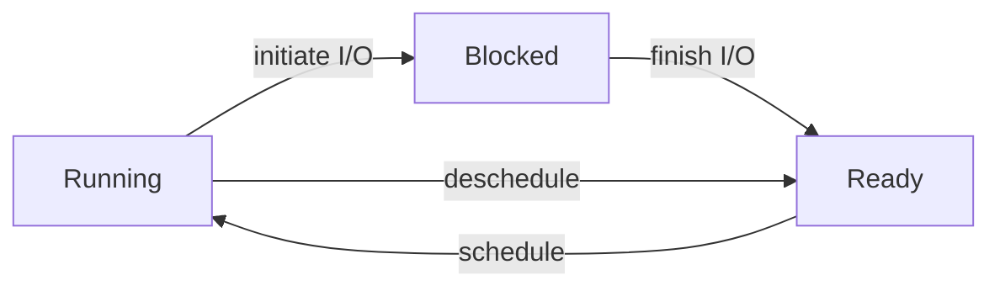

[《Operating Systems: Three Easy Pieces》](https://pages.cs.wisc.edu/~remzi/OSTEP/)第一部分 Virtualization 的学习笔记。

<Excerpt />

## A Dialogue on Virtualization

~~我觉得这个比喻很怪，peach 怎么能 virtualize，感觉不如举个别的例子。但挑 `og:image` 的时候想了想，这不，[桃 channel](https://www.bilibili.com/video/av55053935/) 吗（~~

## The Abstraction: The Process

所谓 <dfn>process</dfn>，就是 *a running program*。

一个 process 的 machine state 包括 memory、register（包括 PC、stack pointer 等）、I/O information（例如打开的文件列表）等。

在创建 process 时，OS 需要 (lazy) load program code 和 data，初始化 stack 和 heap，设置 `argc`、`argv`，设置 `stdin`、`stdout`、`stderr` 三个 file descriptor。

一个 process 有三种 state：running、blocked、ready。

OS 的 scheduler 需要决定如何调度 process state，以优化性能。例如，一个 process initiate I/O 后应当 schedule 到另一个 ready 的 process。

OS 需要维护 process list，记录 process memory address、kernel stack address、register context、process state、pid、parent、killed、opened files、cwd、trap frame 等信息。

## Interlude: Process API

`fork()`、`wait()`、`exec()` 以及 signals 参见 [CS:APP 第八章](/post/2022/11/csapp-8#process-control)。

`fork()` 和 `exec()` 通常配合使用，而被设计成了分离的两个 API，所以可以在它们之间插入其他代码，以修改 child process 的执行环境。例如，在 shell 中执行命令可以创建 child process 然后 wait，如果需要 redirect output，可以在 `fork()` 和 `exec()` 之间执行 `close()` 和 `open()`。

<Card title="A <code>fork()</code> in the road">

`fork()` 的设计有很多缺点：新功能的设计需要考虑到 `fork()`（新的状态如何复制）而变得复杂，`fork()` 不 thread-safe，将所有信息共享给 child process 可能泄露信息，保持 memory layout 不变可能导致 ASLR 失效，不必要地复制整个 address space 会影响性能，不管剩余 RAM 有多少就分配 copy-on-write memory 可能导致 OOM，支持 copy-on-write 会鼓励 monolith kernel，不利于 OS 的创新……[^fork-hotos19]

`fork()` 历史悠久，使用广泛，如果 OS 不实现则会使得很多程序无法运行。但在理论上，`fork()` 可以被替换：[^fork-hotos19]

-   `fork()` + `exec()` 创建 child process 可以替换为合二为一的 (`posix_`)`spawn()`。
-   使用 `fork()` 来实现 multi-process 可以替换为 multi-thread，或者创建全新的 child process（不能共享初始化，但这影响一般不大）。
-   使用 `fork()` 获取 copy-on-write memory，可以增加新的 API 来专门用于这个目的。
-   对于少量仍需使用 `fork()` 而性能要求不高的场景，可以抛弃 low-level 的 `fork()` 而在 high-level（低效地）实现这一功能。

[^fork-hotos19]: [Baumann, A., Appavoo, J., Krieger, O., & Roscoe, T. (2019, May). A fork () in the road. In Proceedings of the Workshop on Hot Topics in Operating Systems (pp. 14-22).](https://www.microsoft.com/en-us/research/uploads/prod/2019/04/fork-hotos19.pdf)

</Card>
