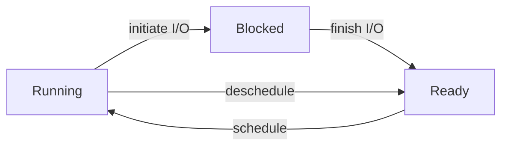

[《Operating Systems: Three Easy Pieces》](https://pages.cs.wisc.edu/~remzi/OSTEP/)第一部分 Virtualization 的学习笔记。

<Excerpt />

## A Dialogue on Virtualization

~~我觉得这个比喻很怪，peach 怎么能 virtualize，感觉不如举个别的例子。但挑 `og:image` 的时候想了想，这不，[桃 channel](https://www.bilibili.com/video/av55053935/) 吗（~~

## The Abstraction: The Process

所谓 <dfn>process</dfn>，就是 *a running program*。

一个 process 的 machine state 包括 memory、register（包括 PC、stack pointer 等）、I/O information（例如打开的文件列表）等。

在创建 process 时，OS 需要 (lazy) load program code 和 data，初始化 stack 和 heap，设置 `argc`、`argv`，设置 `stdin`、`stdout`、`stderr` 三个 file descriptor。

一个 process 有三种 state：running、blocked、ready。

OS 的 scheduler 需要决定如何调度 process state，以优化性能。例如，一个 process initiate I/O 后应当 schedule 到另一个 ready 的 process。

OS 需要维护 process list，记录 process memory address、kernel stack address、register context、process state、pid、parent、killed、opened files、cwd、trap frame 等信息。

## Interlude: Process API

`fork()`、`wait()`、`exec()` 以及 signals 参见 [CS:APP 第八章](/post/2022/11/csapp-8#process-control)。

`fork()` 和 `exec()` 通常配合使用，而被设计成了分离的两个 API，所以可以在它们之间插入其他代码，以修改 child process 的执行环境。例如，在 shell 中执行命令可以创建 child process 然后 wait，如果需要 redirect output，可以在 `fork()` 和 `exec()` 之间执行 `close()` 和 `open()`。

<Card title="A <code>fork()</code> in the road">

-   论文：[A fork() in the road](https://www.microsoft.com/en-us/research/uploads/prod/2019/04/fork-hotos19.pdf)
-   相关讨论：[LWN](https://lwn.net/Articles/785430/)、[Reddit](https://www.reddit.com/r/programming/comments/bbic2e/a_fork_in_the_road/)、[Hacker News](https://news.ycombinator.com/item?id=19621799)

`fork()` 的设计有很多缺点：新功能的设计需要考虑到 `fork()`（新的状态如何复制）而变得复杂，有时需要特殊修改软件来适配 `fork()`（例如 buffered I/O 在 fork 前需要 flush），有的硬件（例如 GPU）不支持复制状态，`fork()` 不 thread-safe，将所有信息共享给 child process 可能泄露信息，保持 memory layout 不变可能导致 ASLR 失效，不必要地复制整个 address space 会影响性能，不管剩余 RAM 有多少就分配 copy-on-write memory（overcommit）可能导致 OOM，支持 copy-on-write 会鼓励 monolith kernel……

`fork()` 历史悠久，使用广泛，如果 OS 不实现则会使得很多程序无法运行。但在理论上，`fork()` 可能可以被替换：

-   `fork()` + `exec()` 创建 child process 可以替换为合二为一的 (`posix_`)`spawn()`。
-   `spawn()` 的参数可能不够灵活，可以添加 cross-process operation 来代替位于 `fork()` 和 `exec()` 之间的任意操作。（但这样的替代可能不够简洁直观。）
-   使用 `fork()` 来实现 multi-process 可以替换为 multi-thread，或者创建全新的 child process。（但这样的话就不能共享初始化，可能会有一定的性能损失。）
-   可以增加新的 API 来代替使用 `fork()` 获取 copy-on-write memory。（可能仍会面临 overcommit 的问题。）
-   对于少量仍需使用 `fork()` 而性能要求不高的场景，或者是为了兼容使用 `fork()` 的软件，可以抛弃 low-level 的 `fork()` 而在 high-level（低效地）实现这一功能。

</Card>

## Mechanism: Limited Direct Execution

“direct execution” 就是直接执行一个 program，但这样做无法对 user program 进行限制，例如可能访问包括 kernel memory、其他 process 在内的任意 memory、一直运行而不把 control 交给 OS。所以，OS 需要采用 *limited direct execution*，对 process 施加限制。这样做虽然 “limited”，但依然是 CPU 直接执行 user program instruction，所以不会有太多的 overhead。

### Problem #1: Restricted Operations

为了限制 user program 的行为，CPU 的执行分为 *user mode* 和 *kernel mode*。kernel mode 具有更高的权限，例如可以直接访问 memory、执行 I/O。

user program 需要通过 *system call* 来进入 kernel mode，由 OS 执行相应的操作。system call 是一种特殊的 *trap*（exception），通过 trap instruction 进入 *trap handler* 并把 register 等状态存下来，操作执行完毕后再 return-from-trap 回到 user program 调用 system call 之后的位置并恢复 register 等状态。

在系统启动时，OS 会设置 *trap table*，即各种 trap 对应的 handler address。*system-call number*（放在特定 register 或 stack 特定位置）用来指定要执行哪个 system call。trap table 只能由 OS 设定，以避免 user program 任意指定 kernel mode 下跳转到的位置。

### Problem #2: Switching Between Processes

在一个 process 占用着 CPU 时，OS 没有运行，自然无法实现 control，所以需要 user program 把 control 交给 OS。这有两种方式，一种是 cooperative approach，即调用 system call；一种是 non-cooperative approach，即使用 timer interrupt，每隔一段时间就把 control 强制交给 OS，以避免单个 process 连续运行过长时间甚至进入死循环而只能重启。

决定了要切换 process 时，OS 会进行 *context switch*，主要操作是从 process A 的 registers 和 kernel stack 切换到 process B 的 registers 和 kernel stack，之后 return-from-trap 时就会返回到 process B 之前离开的地方。
