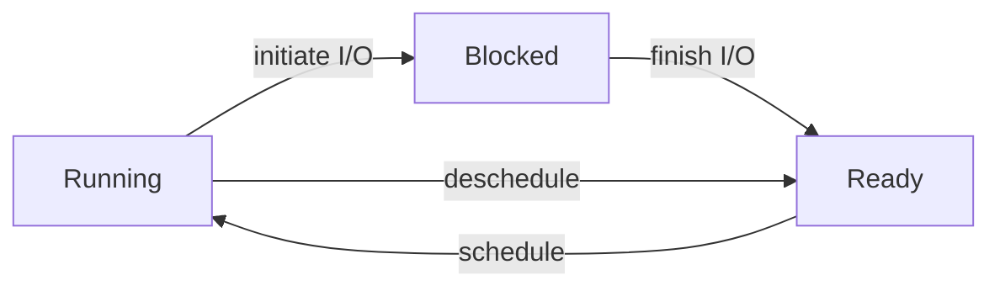

[《Operating Systems: Three Easy Pieces》](https://pages.cs.wisc.edu/~remzi/OSTEP/)第一部分 Virtualization 的学习笔记。

<Excerpt />

## A Dialogue on Virtualization

~~我觉得这个比喻很怪，peach 怎么能 virtualize，感觉不如举个别的例子。但挑 `og:image` 的时候想了想，这不，[桃 channel](https://www.bilibili.com/video/av55053935/) 吗（~~

## The Abstraction: The Process

所谓 <dfn>process</dfn>，就是 *a running program*。

一个 process 的 machine state 包括 memory、register（包括 PC、stack pointer 等）、I/O information（例如打开的文件列表）等。

在创建 process 时，OS 需要 (lazy) load program code 和 data，初始化 stack 和 heap，设置 `argc`、`argv`，设置 `stdin`、`stdout`、`stderr` 三个 file descriptor。

一个 process 有三种 state：running、blocked、ready。

OS 的 scheduler 需要决定如何调度 process state，以优化性能。例如，一个 process initiate I/O 后应当 schedule 到另一个 ready 的 process。

OS 需要维护 process list，记录 process memory address、kernel stack address、register context、process state、pid、parent、killed、opened files、cwd、trap frame 等信息。

## Interlude: Process API

`fork()`、`wait()`、`exec()` 以及 signals 参见 [CS:APP 第八章](/post/2022/11/csapp-8#process-control)。

`fork()` 和 `exec()` 通常配合使用，而被设计成了分离的两个 API，所以可以在它们之间插入其他代码，以修改 child process 的执行环境。例如，在 shell 中执行命令可以创建 child process 然后 wait，如果需要 redirect output，可以在 `fork()` 和 `exec()` 之间执行 `close()` 和 `open()`。

<Card title="A <code>fork()</code> in the road">

-   论文：[A fork() in the road](https://www.microsoft.com/en-us/research/uploads/prod/2019/04/fork-hotos19.pdf)
-   相关讨论：[LWN](https://lwn.net/Articles/785430/)、[Reddit](https://www.reddit.com/r/programming/comments/bbic2e/a_fork_in_the_road/)、[Hacker News](https://news.ycombinator.com/item?id=19621799)

`fork()` 的设计有很多缺点：新功能的设计需要考虑到 `fork()`（新的状态如何复制）而变得复杂，有时需要特殊修改软件来适配 `fork()`（例如 buffered I/O 在 fork 前需要 flush），有的硬件（例如 GPU）不支持复制状态，`fork()` 不 thread-safe，将所有信息共享给 child process 可能泄露信息，保持 memory layout 不变可能导致 ASLR 失效，不必要地复制整个 address space 会影响性能，不管剩余 RAM 有多少就分配 copy-on-write memory（overcommit）可能导致 OOM，支持 copy-on-write 会鼓励 monolith kernel……

`fork()` 历史悠久，使用广泛，如果 OS 不实现则会使得很多程序无法运行。但在理论上，`fork()` 可能可以被替换：

-   `fork()` + `exec()` 创建 child process 可以替换为合二为一的 (`posix_`)`spawn()`。
-   `spawn()` 的参数可能不够灵活，可以添加 cross-process operation 来代替位于 `fork()` 和 `exec()` 之间的任意操作。（但这样的替代可能不够简洁直观。）
-   使用 `fork()` 来实现 multi-process 可以替换为 multi-thread，或者创建全新的 child process。（但这样的话就不能共享初始化，可能会有一定的性能损失。）
-   可以增加新的 API 来代替使用 `fork()` 获取 copy-on-write memory。（可能仍会面临 overcommit 的问题。）
-   对于少量仍需使用 `fork()` 而性能要求不高的场景，或者是为了兼容使用 `fork()` 的软件，可以抛弃 low-level 的 `fork()` 而在 high-level（低效地）实现这一功能。

</Card>

## Mechanism: Limited Direct Execution

“direct execution” 就是直接执行一个 program，但这样做无法对 user program 进行限制，例如可能访问包括 kernel memory、其他 process 在内的任意 memory、一直运行而不把 control 交给 OS。所以，OS 需要采用 *limited direct execution*，对 process 施加限制。这样做虽然 “limited”，但依然是 CPU 直接执行 user program instruction，所以不会有太多的 overhead。

### Problem #1: Restricted Operations

为了限制 user program 的行为，CPU 的执行分为 *user mode* 和 *kernel mode*。kernel mode 具有更高的权限，例如可以直接访问 memory、执行 I/O。

user program 需要通过 *system call* 来进入 kernel mode，由 OS 执行相应的操作。system call 是一种特殊的 *trap*（exception），通过 trap instruction 进入 *trap handler* 并把 register 等状态存下来，操作执行完毕后再 return-from-trap 回到 user program 调用 system call 之后的位置并恢复 register 等状态。

在系统启动时，OS 会设置 *trap table*，即各种 trap 对应的 handler address。*system-call number*（放在特定 register 或 stack 特定位置）用来指定要执行哪个 system call。trap table 只能由 OS 设定，以避免 user program 任意指定 kernel mode 下跳转到的位置。

### Problem #2: Switching Between Processes

在一个 process 占用着 CPU 时，OS 没有运行，自然无法实现 control，所以需要 user program 把 control 交给 OS。这有两种方式，一种是 cooperative approach，即调用 system call；一种是 non-cooperative approach，即使用 timer interrupt，每隔一段时间就把 control 强制交给 OS，以避免单个 process 连续运行过长时间甚至进入死循环而只能重启。

决定了要切换 process 时，OS 会进行 *context switch*，主要操作是从 process A 的 registers 和 kernel stack 切换到 process B 的 registers 和 kernel stack，之后 return-from-trap 时就会返回到 process B 之前离开的地方。

## Scheduling: Introduction

OS scheduler 需要决定 schedule 到哪个 process，这表现为 *scheduling policy* (*discipline*)。

### Workload Assumptions

在这一部分，我们先对 *workload*，即需要运行的 processes（即 jobs），作一些（不切实际的）assumption 以简化问题，后面再逐步丢弃这些 assumption：

1.  每个 job 用时相同。
2.  每个 job 同时 arrive。
3.  每个 job 一旦开始就一直运行到结束，不被打断。
4.  每个 job 都只使用 CPU，不使用 I/O（没有 system call，不会 blocked）。
5.  每个 job 的用时是已知的。

其中，4 和 5 是最不切实际的：没有 I/O 的 program 运行了没有任何意义；scheduler 无法预知 job 要运行多久（连是否停机都无法预知）。

### Turnaround Time

*turnaround time* 是一个 *scheduling metric*，它指的是一个 job 从 arrival 到 completion 的用时，用来衡量总体性能。

FIFO (first in first out / FCFS, first come first served) 是一种最简单的 scheduling policy。在所有 5 个 assumption 下，任何 scheduling policy 都是一样的，FIFO 就可以达到最优。

如果丢弃 assumption 1 而继续使用 FIFO，当排在最前的 job 用时很长时，会造成 *convoy effect*，堵住后面用时短的其他 job，使得 turnaround time 变得很大。此时，可以采用 SJF (shortest job first) 达到最优解。

如果进一步丢弃 assumption 2，有可能最长的 job 最先到，短的 job 紧随其后，SJF 就失效了。此时，需要再丢弃 assumption 3，来允许 scheduler *preempt* 一个 job 而 schedule 到另一个（不这样做的 scheduler 被称作 *non-preemptive* scheduler），然后就可以采用 STCF (shortest time-to-completion first / PSJF, preemptive shortest job first) 达到最优解：在新 job arrive 时，如果它的总用时比当前 job 的剩余用时还短，可以 schedule 到新 job。

### Response Time

为了让用户在交互中获得更好的体验，turnaround time 是不够的，还需要引入新的 metric，*response time*，它可以用一个 job 从 arrival 到 first run 的用时衡量。

上面提到的各种 scheduling policy，例如 STCF，response time 都很差，被排到后面运行的 job 需要等待很久。

Round-Robin (RR) policy 会让每个 job 运行一个 *time slice* (*scheduling quantum*)，然后切换到下一个 job，所以 RR 也被称作 *time-slicing*。time slice 越小 response time 也就越小，但如果 time slice 过小，context switching（包括存储/恢复 register，以及 cache miss penalty）在用时中的占比就会过大，从而显著影响性能，所以需要一定大小的 time slice 来 *amortize* 掉 context switching cost。RR 的 response time 较小，但 turnaround time 很大，比 FIFO 还大。

一般来说，如果一个 policy 是 *fair* 的，均等地将 CPU 分配给各个 job，就会有较差的 turnaround time 和较好的 response time；如果一个 policy unfair，就可以有较好的 turnaround time，但 response time 会较大。这是一个固有的 trade-off：鱼与熊掌，不可兼得。[^cake]

[^cake]: 作者推荐阅读：[You can't have your cake and eat it - Wikipedia](https://en.wikipedia.org/wiki/You_can%27t_have_your_cake_and_eat_it)  
         “The best part of this page is reading all the similar idioms from other languages.”

### Incorporating I/O

如果进一步丢弃 assumption 4，即允许 job 进行 I/O，则需要处理 blocked 的情况。

一般来说，可以将一个 job 视作被 I/O 分割成的多个 sub-job，然后按照之前的 policy 进行 schedule。例如，使用 STCF 时，在 sub-job 的视角下，会优先运行 I/O 密集的 job，这可以达成 *overlap*，让 CPU 和 I/O 同时工作，更加充分地利用系统资源。

## Scheduling: The Multi-Level Feedback Queue

之前这些简单的 scheduling policy 面临两大问题，一是 turnaround time 和 response time 之间的矛盾，二是 SJF/STCF 对 perfect knowledge（assumption 5）的依赖。

Multi-level Feed-back Queue (MLFQ) 是目前被广泛使用的一种 scheduling policy，同时解决了这两大问题。

### Basic Rules

MLFQ 的基本思路是，workload 可以分为两类，一类是 short-running interactive job（被 I/O 切成了小块），一类是 long-running CPU-intensive job。interactive job 更需要优先运行，这既是 SJF/STCF 的基本思想，同时也是因为 interactive job 对 response time 的要求更高。

MLFQ 的基本运行规则为：有多个不同 priority 的 job queue，每次会选择 priority 最高的 queue，在同一个 queue 内使用 RR。

理想情况下，interactive job 的 priority 会更高，从而逼近 STCF。

### Priority Adjustment

因为 scheduler 无法预先知道 job 的类型，priority 是根据程序的运行情况动态设置的。

job arrive 时会先放在 priority 最高的 queue，如果运行太久就会降低 priority。具体来说，一个 job 在每一级 queue 会获得一段 *time allotment*，在这一级 queue 的累计运行时长如果超过 allotment 就会降低 priority 到下一级 queue。

在这样的机制下，会有两个问题：

-   CPU 可能被几个 interactive job 占满，导致 priority 低的 long-running job 一点 CPU 都拿不到（这被称作 *starvation*）。
-   一个 job 的行为可能随时间变化，如果经过一段 CPU-intensive 后 priority 到了最低，然后变为 interactive，priority 无法恢复。

为了解决这两个问题，可以每隔一段时间进行 *priority boost*，将所有 job 的 priority 设为最高。

<Card title="Game the scheduler">

如果 allotment 不是计算累计用时，而是每次运行时单独判断这次有没有到一个 threshold，没达到就不降低甚至提高 priority，是否可以达到同样的效果，甚至自动检测到 long-running 转变为 short-running 而提升 priority？

答案是，这样会允许一个 program 恶意地 *game the scheduler*，每次都恰好在 threshold 之前一点点执行 I/O，从而在长时间占用 CPU 的同时维持最高的 priority，最终达到接近独占 CPU 的效果。这在多个用户共享 CPU 时（例如在云服务器上）可能造成安全问题。

</Card>

### Tuning MLFQ

MLFQ 有很多可以设置的参数：queue (level) 的数量，每个 level 的 time slice 和 allotment，多久进行一次 priority boost。一般来说，priority 越高，time slice 和 allotment 越短。

MLFQ 不一定真的要实现为多个 queue，也可以统计每个 job 的 CPU usage，根据 usage 计算出 priority，而让 usage 随时间 *decay* 来代替 priority boost，这称作 *decay-usage* scheduling。

priority 不一定要完全基于 feedback，也可以参考由用户提供的 *advice*，例如使用 `nice` 命令可以设置 *niceness* 来影响 job priority。

## Scheduling: Proportional Share

这章讨论的是一种不同的 scheduler，它的主要目标是按一定的比例将 CPU 分配给各个 job。例如，在 virtualized data center / cloud 中，可以将 CPU 均等地分配给各个用户。

### Lottery Scheduling

在 *lottery scheduling* 中，每个 job 被分配了一定数量的 *ticket*，每个 time slice 结束时随机选择一个 winning ticket，schedule 到对应的 job，时间久了之后会趋近于按 ticket 数量的 CPU 分配。

lottery scheduling 还会提供一些 ticket mechanism：

-   可以给每个 user 一些 ticket，每个 user 再将 ticket 分给各个 job。
-   一个 job 可以将自己的 ticket transfer 给其他 job。
-   如果各个 job 之间互相信任，可以进行 ticket inflation，一个 job 需要更多 CPU 时直接给自己更多 ticket 即可，不需要和其他 job 沟通。

### Stride Scheduling

stride scheduling 不依赖于随机，可以确定性地达到设定的比例。

用一个大数除以每个 job 的 ticket value 得到每个 job 的 *stride*，对每个 job 维护一个 *pass*，每次运行一个 job 后将 pass 加上 stride，schedule 到 pass 最低的 job。每个循环内都会精确地达到设定的比例。

stride scheduling 的一个劣势是新加入的 job 的 pass 不好设定，而 lottery scheduling 不需要维护状态，可以轻松地添加新的 job。

### The Linux Completely Fair Scheduler (CFS)

Linux 的 Completely Fair Scheduler (CFS) 高效而 scalable 地实现了 fair-share scheduling。

CFS 会记录每个 job 的 *virtual runtime* (`vruntime`)，每次运行后加上这次运行的时长，schedule 到 `vruntime` 最低的 job。time slice 是不固定的，由 `sched_latency` 除以 job 数量决定，并会与 `min_granularity` 取较大值，防止 time slice 过小导致 context switching 过多。time slice 可能不是 timer interrupt 的整数倍，但 `vruntime` 会精确记录实际用时。

可以通过设置 `niceness` 调整一个 job 的 `weight`，`niceness` 越低 `weight` 越高，呈指数降低的关系。设置了 `niceness` 后，time slice 会按照 `weight` 分配，而 `vruntime` 每次增加的值会再调整回来，即 `weight` 大的会获得更大的 time slice 而增长同样多的 `vruntime`。

CFS 使用 red-black tree 维护各个 job 的 `vruntime` 以快速取出最小值。一个 job blocked 时会从树上移除，而再插入到树上时其 `vruntime` 会设为此时树上的最小值，以避免一个长期 blocked 的 job 恢复后独占 CPU，但这样会导致 I/O 频繁或长期 sleep 的 job 实际上没有拿到 fair share。

作为一个得到了广泛实际应用的 scheduler，CFS 还有很多其他 feature，例如通过一些手段优化了 cache performance，可以高效处理有多个 CPU 的情形，可以将多个 process 视作一个 group 而不是对每单个 process 进行 schedule。

## Multiprocessor Scheduling

<Card type="wip">

> As this topic is relatively advanced, it may be best to cover it after you have studied the topic of concurrency in some detail (i.e., the second major “easy piece” of the book).

</Card>

## The Abstraction: Address Spaces

为了支持 time sharing，需要在 physical memory 中同时存放多个 process 的 memory。为了便于使用，OS 需要将 physical memory virtualize，提供称作 *address space* 的 abstraction。

一个 process 的 address space 包括 code、stack、heap、data 等部分，各个部分一般有较为固定的 layout，但其对应的 physical memory address 是不固定的。

virtual memory (VM) 需要达到若干个目标：

-   transparency: process 感受不到 VM 的存在，像是独占了整个巨大的 physical memory。
-   efficiency: time 和 space 两方面的 overhead 都不能太大，需要 hardware 的配合。
-   protection / isolation: 每个 process 只能访问自己的 address space，不能访问其他 process 或者 OS 自身的 memory。

user-level program 使用的所有 address 都是 virtual address，只有 OS（以及 hardware）能接触到 physical address。

## Interlude: Memory API

C program 可以使用 stack memory 或 heap memory。

stack memory 的 allocation 和 deallocation 都是 implicit 的，又称作 *automatic* memory。

heap memory 需要使用 `malloc()` allocate，使用 `free()` deallocate，例如：

-   `double *d = malloc(sizeof(*d))`
-   `int *x = malloc(sizeof(*x) * 10)`
-   `char *s = malloc(strlen(buf) + 1)`
-   `free(x)`

heap memory 的使用很容易出错，例如：

null pointer dereference
:   使用前没有 allocate

uninitialized read
:   没有初始化内容就读取（以为内容会是 0）

buffer overflow
:   allocate 的 memory 不够大，例如字符串没有在长度的基础上加一

memory leak
:   long-running program 的 heap memory 使用完毕后没有 free

use after free
:   在 free 之后继续使用 *dangling pointer*

double free
:   free 之后再次 free

<Card type="info" title="Tip: if it compiles it works" fold>

>   Just because a program compiled(!) or even ran once or many times correctly does not mean the program is correct.

>   Get to work and debug it before you blame those other components.

~~这边建议您用 Rust（~~

</Card>

`malloc()` 和 `free()` 不是 system call，而是 library call。malloc library 使用 system call `brk()`/`sbrk()` 设置 program 的 *break*（heap 末尾的 address）来获取 memory，进而分配给用户。

另外还有 `calloc` 可以用来初始化 malloc 得到的 memory，`realloc` 可以用来调整一块已分配的 heap memory 的大小。

可以用 `mmap` 进行 memory mapping，例如可以 map 到 anonymous file 来获取一块 memory。

## Mechanism: Address Translation

为了高效且灵活地 virtualize memory，基本思想是 *(hardware-based) address translation*，将 memory access 从 virtual address 翻译为 physical address。OS 会管理 memory，配置 hardware，最终由 hardware 高效地进行 address translation。

我们先做一些简化，假设：

-   每个 process 的 address space 都映射到了 physical memory 中连续的[^contiguous]一段
-   各个 process 的 address space size 相同
-   physical memory 足够大，能装下所有 process 的 address space

[^contiguous]: 注意是 “contiguous” 而不是 “continuous”，~~discrete topology 下随便 map 都 continuous（~~

<Card title="Software-based Relocation">

在早期还没有 hardware support 时，有的系统使用了一种 software-based relocation，其原理是在 load program 时进行 address translation。

这样做不能提供 protection（没有限制可以访问的 address），而且很难再次 relocate（移动 address space 对应的 physical memory），所以后来被抛弃了。

</Card>

### Base and Bounds

在 1950’s，当时的计算机使用了被称作 *base and bounds*[^bounds] / *dynamic relocation* 的技术实现简单高效且能提供 protection 的 VM。

[^bounds]: **bound** noun (formal) 蹦跳；跳跃  
           **bounds** noun [pl.] 限制范围；极限 

CPU 中添加两个 register，*base* 和 *bounds*。base 即 virtual address 0 对应的 physical address，在 access memory 时进行 address translation，用 base 加上 virtual address 计算 physical address。bounds 是 address space 的大小，会检查 virtual address 不超过 bounds。

### Hardware Support

为了实现 base and bounds，需要若干 hardware support：

-   支持 kernel mode 和 user mode。
-   在 *memory management unit* (MMU) 中提供 base register 和 bounds register。
-   提供特殊的 privileged instruction 来修改 base 和 bounds，只有 OS 能修改它们，否则一个 user process 将可以 wreak havoc[^wreak]。
-   在 memory access 超出 bounds 时 generate exception，调用 exception handler。

[^wreak]:   “Is there anything other than ‘havoc’ that can be ‘wreaked’?”  
            我想作者可能需要一本牛津词典或者 http://www.just-the-word.com/ （

### Operating System Issues

OS 需要做的工作有：

-   在 create process 时为其分配 memory。
-   在 terminate process 时回收 memory。
-   在 context switch 时存储、设置 base 和 bounds。此时可以进行 relocate：将 base 修改为与上次 schedule 到这个 process 时不同的位置，并将数据复制过去。
-   提供 out-of-bounds memory access 的 exception handler，一般会 kill 掉这个 process。

在我们简单的假设下，可以使用一个 *free list* 维护空闲的 memory slots。

## Segmentation

在 Base and Bounds 中，heap 和 stack 之间的空位一般不会用满，但没有使用的空间也会占用 physical memory，这会造成严重的浪费（*internal fragmentation*）。并且，Base and Bounds 不支持运行 address space 比 physical memory 大的 program。所以我们需要更灵活高效的机制来支持 large address space。

我们可以使用 *segmentation*，将 memory space 划分成多个 *segment*，例如 code、stack 和 heap，每个 segment 是连续的，但整体不必连续，从而可以更加灵活地进行分配，减少 internal fragmentation。

### Hardware Support

为了支持 segmentation，需要将整体的一对 base and bounds register 变成每个 segment 各一对。

在进行 address translation 时，需要先识别一个 address 属于哪个 segment。explicit approach 通过 address 的最高几位作为 segment 标识，而 implicit approach 通过地址的生成方式（是否来自 PC / stack pointer）判断 segment。

stack 是 grow backwards 的，需要特殊支持。可以在 hardware 中添加表示 grow 方向的 flag bit，对于 grow backwards 的 segment，其 base 是这段 address 的上界，offset 是负数，越界判断也有所不同。

为了支持 shared memory，尤其是 code sharing，需要添加 protection bits，表示一个 segment 是否可以 read / write / execute。进行 code sharing 时，可以将权限设为 read-execute，禁止修改，从而既能 share 又能 isolate。这也能避免 stack / heap 被执行，一定程度上避免一些攻击。

只分成 code、stack、heap 等少量几个 segment 被称作 *coarse-grained* segmentation。有的系统支持成百上千个 segment，称作 *fine-grained* segmentation，这需要存储 *segment table*。

### OS Support

为了支持 segmentation，OS 需要做的事情有：

-   在 context switch 时存储、切换 segment registers
-   管理 physical memory 的 free space，从而支持：
    -   创建新的 address space 
    -   segment grow，例如 `sbrk()`

由于 segment 的 size 是不固定的，physical memory 中各个 segment 之间可能会出现很多空洞，这被称作 *external fragmentation*，导致 free space management 非常困难。

一种解决方式是进行 *compact*，通过挪移 segment 来消除 external fragmentation，但这需要频繁移动大量数据，非常 expensive，效率很低。所以，一般不会进行 compact，而是会使用其他方式尽量减少 internal fragmentation。

## Free-Space Management

如果 memory 被分成了 fixed-size units，以 unit 为分配的基本单位，则 free-space management 会比较容易。如果分配出的每一块 memory 大小各异，则容易造成 external fragmentation，需要一些机制来优化。

参见 [CS:APP 第九章 Dynamic Memory Allocation](/post/2022/11/csapp-9#dynamic-memory-allocation)。

## Paging: Introduction

将 memory 分成 variable-sized pieces 会使 free-space management 比较困难，所以，在 virtual memory 中，一般实际上会分成 fixed-size units，address space 中的每个 unit 称作一个 *page*，对应的 physical memory 称作 *page frame*，这个做法称作 *paging*。

paging 可以避免 external fragmentation，并且更加 flexible，可以支持 sparse address space，也不需要对 program 如何使用 address space 进行假定，例如不需要对 stack 的 grow 方向进行特殊处理。

*page table* 用来记录 virtual page 和 physical frame 的对应关系，用于 address translation。每个 process 都各有自己的 page table，context switch 时需要切换 page table。

在进行 address translation 时，需要将 address 分成 *virtual page number* (VPN) 和 *offset* 两部分，其中 offset 位于低位，位数对应一个 page 的大小。VPN 作为 page table 的索引来访问对应的 *page table entry* (PTE)，从而得到 *physical frame number* (PFN, or PPN)，再将 PFN 和 offset 拼接就可以得到最终的 physical address。

page table 比较大，不像 base and bounds 可以存在专门的 hardware 里，而是要存在 physical memory 中。

page table 可以使用各种数据结构存储，最简单的是 *linear page table*，就是一个一维数组，以 VPN 作为下标。但无论如何，page table 的基本数据单位是 PTE。

一个简化的 PTE 需要存储 PFN、valid bit 和 protection bits。其中，valid bit 表示有的 page 是 invalid 的，没有分配 physical frame，可以节约 memory。另外，实际的 PTE 还会有 present bit、dirty bit、reference bit 用于 swapping。根据具体实现可能还会存一些别的信息。

在现在这个简单的 page table 设计下，每次 memory access 都需要访问两次 physical memory（先访问 page table 再访问实际目标），而且 address space 较大时 page table 也会很大，也就是说它的 time 和 space overhead 都很大，需要进一步优化。

## Paging: Faster Translations (TLBs)

为了解决 page table 的 time overhead，需要 hardware 的帮助，即使用 *translation lookaside buffer* (TLB)[^tlb] 来加速 page table access。

[^tlb]: “lookaside buffer” 是 cache 的历史名称，后来 “lookaside buffer” 被 “cache” 取代，但 “TLB” 保留了下来。现在看来一个更合理的名称或许应当是 “address-translation cache”。

TLB 中存储了少量 PTE，进行 address translation 时，首先查找 TLB，找到了称作 TLB hit，否则称作 TLB miss，需要再读取 page table，返回结果并更新 TLB。TLB miss 代价高昂，需要尽可能避免。

### Locality: Why is TLB Hit Rate High?

TLB 利用了 program 的 *spatial locality*，即一小段时间内访问的 address 一般是邻近的，很多 address 位于同一个 page，从而可以 TLB hit；也利用了 *temporal locality*，即一小段时间内同一个 address 可能被多次访问，从而可以 TLB hit。

locality 是 program 的性质，不同 program 有着不一样的 locality，这会影响其性能。如果 program 短时间内访问的 page 数量超过了 TLB 的容量，就可能产生大量 TLB miss，这称作 exceeding the *TLB coverage*。有的 program 由于其特殊性就是需要随机大范围访问 memory，例如使用了复杂数据结构的 DBMS，可以为它们设置更大的 page size，来缓解这一问题。

### Who Handles The TLB Miss?

TLB miss 可以由 hardware 或 software 处理。

在 hardware-managed TLB 中，page table 有固定的格式，OS 需要设置 page table base register，由 hardware 进行 TLB miss 的处理（page table 的访问）。

在 software-managed TLB 中，TLB miss 会触发 trap，由 OS 提供的 trap handler 进行处理，使用特殊的 privileged instruction 修改 TLB。这样 OS 可以灵活设计 page table，不受 hardware 的限制。这个 trap handler 有两点需要注意：

-   返回到 user program 时，要返回到触发 trap 的那条 instruction，而非像 system call 一样返回到下一条 instruction。
-   trap handler 自身不能再触发 TLB miss，要么 trap handler 直接访问 physical memory 绕开 TLB，要么在 TLB 中设置一些 *wired* translation，永久保留在 TLB 中不被清除。

### TLB Contents: What’s In There?

TLB entry 的内容一般包括：

-   PTE 的信息：PFN、protection bits、dirty bit 等
-   VPN：TLB 一般是 [fully associative](/post/2022/12/csapp-6#cache-的分类) 的，需要存储 VPN 作为 cache tag
-   valid bit：表示这个 TLB entry 存储的信息是否 valid，和 page table 的 valid bit 不同
-   wired：表示这个 entry 永远 valid，不被清除/替换
-   [ASID](#tlb-issue-context-switches)

### TLB Issue: Context Switches

由于每个 process 的 page table 不同，context switch 时需要处理 TLB 的更新。

一种方法是在 context switch 时完全清空 TLB（将 valid bit 全部置 0），但这样的话每次 context switch 后都会 TLB miss，性能较差。

另一种方法是在 TLB 中存储 *address space identifier* (ASID)，它与 PID 类似，用来表示这个 TLB entry 对应于哪个 address space。查找 TLB 时，需要同时比较 VPN 和 ASID。这样既保证了不同 process 访问到不同的 page table，又不至于在 context switch 时完全损失掉 TLB。

### Issue: Replacement Policy

如果 TLB 满了，添加新的 entry 时需要替换掉一个旧的，需要根据 [replacement policy](#beyond-physical-memory-policies) 进行选择。

## Paging: Smaller Tables

接下来还需要优化 page table 的 space overhead，即减小 page table 自身占用的 memory。在优化前，一个 32-bit address space 在 page size 为 4KB、PTE 占用 4B 时需要占用 4MB 的空间。

### Simple Solution: Bigger Pages

增大 page size 可以让 PTE 数量变少，从而减小 page table 占用的空间。但更大的 page size 可能导致严重的 internal fragmentation，所以不能盲目扩大。

有的 OS 确实支持更大的 page size，但其目的是降低 TLB 的占用，提升 TLB hit rate，而非减小 page table size。

### Hybrid Approach: Paging and Segments

可以尝试将 paging 和 segmentation 的优点结合起来：整体进行 segmentation，在 segment 内部使用 paging，每个 segment 各有一个 page table，base 和 bounds 指向 page table。这样的话，address space 中不属于任何一个 segment 的部分无需占用 page table 的空间。

然而，这种做法依然有很多问题：

-   需要 segmentation，损失了一些 flexibility。
-   一个 segment 的内部如果太 sparse，其 page table 依然会很大。
-   虽然分配给 program 的 memory 是以 page 为单位的，但现在 page table 变成了 variable-sized，为 page table 分配空间又变得困难，会产生 external fragmentation。

### Multi-level Page Tables

很多 modern system 使用的都是 multi-level page table：将 page table 分成多级形成树状结构，上一级 PTE 在 valid 时指向下一级 page table，访问上一级使用的 index 是对应的下一级的 index 的公共前缀。

这样做既省下了大量 invalid PTE 占用的空间，又避免了上述 hybrid approach 的缺点。一个 page table 的 size 可以控制在一个 page，这也使得为 page table 自身分配 memory 更加容易。

但它也有一些缺点：在 TLB miss 时，需要访问多个 level 的 page table，即多次 memory access，开销更大；实现起来更复杂。

### Inverted Page Tables

普通的 page table 是对每个 VPN 有一个 entry 存 PFN，而 inverted page table 则是对每个 PFN 有一个 entry 存 VPN，并且所有 process 共用一张 inverted page table，每个 entry 还会记录对应的 process。为了快速查询，需要用一些数据结构维护这张 table，例如 hash table。

### Swapping the Page Tables to Disk

实际上，page table 不一定放在 physical memory 中，也可能它自身就使用 virtual memory，这使得 page table 自身可以被 swap 到 disk 上，避免 physical memory 放不下 page table。

## Beyond Physical Memory: Mechanisms

physical memory 可能装不下整个 virtual memory（所有 process 的 address space），这时可以将一部分 page 存在 disk 上。支持更大的 virtual memory，一方面可以让 programmer 无需考虑 memory 不够用要怎么办，另一方面可以在 physical memory 有限的情况下支持更多 process 同时运行。

### Swap Space

为了将 page 存储在 disk 上，需要在 disk 上预留出一块 *swap space*。OS 可以通过 disk address 读写 swap space。

只不过，swap space 并不是 swapping 在 disk 上唯一的数据来源，例如，program 存储在 disk 上，所以可以从 disk 上 load，无需再保存到 swap space。

### Page Fault

为了支持 swapping，需要在 PTE 中增加 *present bit*，表示这个 page 是否在 physical memory 中。如果访问了不在 physical memory 中的 page，则会触发 *page fault*[^page-fault]。

[^page-fault]: page fault 虽然叫做 “fault”，但它其实是 legal access，称它为 “page miss” 或许会更好。只不过，hardware 需要将这作为一种异常情况交给 OS 处理，和其他 illegal action 类似，所以称它是 “fault”。另外，有时人们也会将 illegal memory access 一并统称为 “page fault”，可能会将 “page fault” 分成几类，其中一类是 page miss，需要根据上下文进行判断。

无论使用 software-managed TLB 还是 hardware-managed TLB，page fault 都是由 OS 提供的 page fault handler 处理的。这是因为 page fault 不适合由 hardware 处理：一方面，disk 速度慢，访问耗时长；另一方面，这涉及到 swap space 的使用以及 disk I/O 的处理，流程复杂。

在进行 disk I/O 的过程中，process 会处于 blocked state，此时 OS 可以运行其他 process。

### When memory is full

在 *page in* 的时候，如果 physical memory 满了，则需要先 *page out* 一些 page，OS 通过 [*page-replacement policy*](#beyond-physical-memory-policies) 选择这些 page。

只不过，一般并不会等到 physical memory 完全耗尽才进行 page out，而是会在剩余的 physical memory 不多时就在 background 运行 *swap daemon*，evict 掉一些 page，来保持 physical memory 有一定量的空余。这样一方面可以批量处理，效率更高（尤其是 disk I/O），另一方面，在 background 运行可以更好地利用 idle time。

## Beyond Physical Memory: Policies

由于 disk 访问速度非常慢，page hit rate 略微提高一点，average memory access time 就可以下降很多，所以使用一个好的 replacement policy 非常重要。

（当然，为了获得更好的性能，也可以选择增大 physical memory。）

### Replacement Policies

为了衡量 replacement policy 的优劣，由于 hit rate 受到具体 sample 的影响，光看 hit rate 会缺少一些 context，可以和 optimal policy (OPT) 进行比较。假设可以预知未来，可以证明，最优的 policy 是 *furthest in the future*，即每次 evict 掉最远会被再次访问的 page。当然，实际上是无法预知未来的，所以需要使用其他尽量优的 policy。

FIFO 和 random 是两种简单的 policy，他们实现简单，但比较笨，容易 evict 掉频繁访问的 important page。

和 [scheduling policy](#scheduling-introduction) 一样，可以基于历史预测未来，来逼近最优。replacement policy 主要关注 page 的 *frequency* 和 *recency*，其原理是 program 的 locality。有 *least-frequently-used* (LFU)、*least-recently-used* (LRU)，以及相反的 MFU、MRU 等 policy，其中 LRU 是最常用，效果较好的，实现相对简单的。

### Workload Examples

完全随机访问，没有 locality：FIFO、random、LRU 表现相同，hit rate 和 cache size 成正比。

80% 的访问集中在 20% 的 “hot” page：LRU 的性能介于 FIFO/random 和 OPT 之间。

循环访问若干个 page：在 cache size 足够大时各种 policy 都是 100% hit，在 cache size 较小时，LRU 和 FIFO 会退化至 100% miss，random 仍有合理的性能。

也就是说，LRU 虽然一般性能较好，但在 corner case 下性能会很差。现在的 OS 一般会采取一些额外的措施来做到 *scan resistant*，避免 worst-case behavior。

### Implementing LRU

LRU 的实现需要记录每一次 memory access，精确实现比较 expensive，所以一般只是取近似。

在 page table 中会为每个 page 存一个 *reference bit*，访问一个 page 时 hardware 会将 reference bit 置为 1。

OS 可以用各种方式使用 reference bit 来逼近 LRU，例如 *clock algorithm*：循环扫描所有 page，如果 reference bit 为 1 则置为 0 然后继续扫描，直到 reference bit 为 0，选择这个 page。也不一定要循环扫描，可以随机选择。

### Considering Dirty Pages

page replacement 还需要考虑一个 page 是否 *dirty*，即是否被修改过。dirty page 被 evict 时需要将数据写回到 disk 上，clean page 则不需要。所以 evict dirty page 更加 expensive，replacement policy 一般会考虑优先选择 clean page。例如在 clock algorithm 中可以先扫描一轮 clean page，没找到再扫描 dirty page。

### Other VM Policies

除了 replacement policy，OS 还需要考虑何时将一个 page 放进 physical memory。普通的做法是 *demand paging*，即等到真的使用的时候才 page in。有时也可以进行 *prefetch*，例如在使用一个 page 的同时 load 相邻的下一个 page，或者在 program 提供 hint 时进行 prefetch。

另一个 policy 是何时将 page 写回到 disk 上，可以进行 *clustering* (*grouping*)，进行少次多量的 disk write，性能更好。

### Thrashing

如果 running processes 的 *working set*（正在使用的 page）太大，physical memory 装不下，就会出现 *thrashing*，会一直进行 paging，极大影响系统性能。

早期的系统 physical memory 较小，出现这种情况比较正常，可以使用 *admission control*，暂停一部分 process 的运行，以减小 working set。

现在的系统则一般会使用 *out-of-memory killer*，在 memory 占用过高时 kill 掉一些 process。

## Complete Virtual Memory Systems

### VAX/VMS Virtual Memory

VAX/VMS 是 1970/80 年代的系统，有很多 idea 延续至今。

address space 被分成 *process space* 和 *system space* 两部分。process space 又被分成 *P0* 用来放 code 和 heap，以及 *P1* 用来放 stack，而 system space *(S)* 用来放 OS code 和 data，在 protection bits 中设置了更高的 privilege level。

page size 只有 512B，因此优化 page table 占用的空间非常重要。它使用的是 [hybrid of paging and segmentation](#hybrid-approach-paging-and-segments)，并且 page table 放在 kernel virtual memory 中，可以 swap 到 disk 上。

code segment 的 address 并非从 0 开始，从而可以检测到 null-pointer access。

kernel address space 是 user address space 的一部分，在 context switch 时只更改 P0 和 P1 的 base and bounds，不更改 S。为 kernel 使用 virtual address 便于 swap page table to disk，也便于在 kernel 和 user program 之间 copy data。

VAX 的 hardware 不维护 reference bit，VMS 实现的也不是 LRU，而是 *segmented FIFO*：

-   每个 process 有自己的 FIFO list，另有 global 的 clean page list 和 dirty page list。
-   对每个 process 限制了 *resident set size* (RSS)，以防止单个 process 占用过多 memory。
-   一个 process 使用的 page 数量超过 RSS 之后，会将 process FIFO list 里的 page 移到 global list（保留在 physical memory 中不 evict）。
-   需要进行 page replacement 时从 global clean page list 取。
-   如果 access 了一个在 global list 的 page，则将其移回 process FIFO list。
-   定期将 dirty page list 批量写回到 disk，然后移动到 clean page list。

有两个 lazy optimization：

demand zeroing
:   request 一个 page 时，为了 security 需要将其内容清空，但不需要立即清空，而是可以等到真正被使用了再清空，如果最后没被使用就不用清空了。

copy-on-write
:   复制 page 时先将两边都设为 read-only 并指向相同的 physical memory，写入时会触发 trap，然后再真的进行 copy 并设为 writable。这对 `fork()` 尤其有用。

### The Linux Virtual Memory System

Linux address space 分为 user portion 和 kernel portion。

kernel virtual address 分为两种：

-   *kernel logical address*，使用 `kmalloc` 获取，不能 swap to disk，和 physical address 是相差固定 offset 的简单对应关系，所以对应的 physical address 是连续的，适用于 direct memory access 等场景。
-   *kernel virtual address*，使用 `vmalloc` 获取，更容易分配大块的 memory，对应的 physical address 不一定是连续的。

Linux 支持 *huge page*。以前需要 program 主动请求使用 huge page，后来又有了 *transparent huge page*，可以自动使用更大的 page size，以在 working set 很大时减少 TLB miss。只不过更大的 page size 也可能造成更严重的 internal fragmentation。

Linux 中有两种 memory mapping：memory-mapped file 和 anonymous memory。前者可以 map file to memory，常用于 load program 以及 shared library，从而一个 page 等到真正使用才会从 disk 读取，称作 *depand paging*；后者用于 heap 和 stack。

Linux 使用 *2Q* replacement policy，以解决 LRU 的 worst-case behavior：

-   有两个 queue，*inactive list* 和 *active list*，分别近似 LRU
-   首次访问 page 会进入 inactive list，再次访问则进入 active list
-   定期将一些 page 从 active list 移入 inactive list
-   evict 时优先选择 inactive list

这样的话，inactive page 就不会将 active page 挤出 physical memory。

为了缓解 buffer overflow attack，permission bits 中需要添加 *NX bit* (no-execute)，并且使用 *address space layout randomization* (ASLR)。

为了缓解 [Meltdown/Spectre attack](https://spectreattack.com)，可以创建单独的 kernel address space，称作 *kernel page-table isolation* (KPTI)，在切换到 kernel mode 时需要切换 page table，这对性能有一定的影响。
